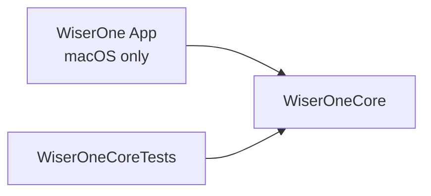

# WiserOne

Daily quotes in a macOS menu bar app.

## What Ships

- `WiserOne`: macOS AppKit executable.
- `WiserOneCore`: platform-neutral module for resource resolution logic.

## Platform Support

| Platform | Build | Test | Run Desktop App |
| :--- | :--- | :--- | :--- |
| macOS | `swift build` | `swift test` | `swift run WiserOne` |
| Linux | `swift build` | `swift test` | Not supported |
| WSL2 (Ubuntu/Debian) | `swift build` | `swift test` | Not supported |

## Day 1 Setup

```sh
git clone https://github.com/sebastienrousseau/WiserOneApp.git
cd WiserOneApp
make init
swift build
make test
```

Run the app on macOS:

```sh
swift run WiserOne
```

Onboarding target: 15 minutes on a fresh machine.

## Quality Gates

Run core quality gates:

```sh
make security
make test
make hygiene
make ci-local
```

`make hygiene` runs:

- `./scripts/quality/verify-portability.sh`
- `./scripts/quality/verify-docs-completeness.sh`
- `./scripts/quality/verify-content-integrity.sh`
- `./scripts/quality/lint-shell.sh`

Refresh tracked governance artifacts only when needed:

```sh
make governance-refresh
```

## UI Test Target

This repository includes a dedicated macOS UI-focused XCTest target:

- `WiserOneUITests`

Run only UI-focused tests:

```sh
make test-ui
```

Run all tests (core coverage gate + UI tests):

```sh
make test-all
```

## Signed Commits

Enable commit signing locally:

```sh
git config commit.gpgsign true
git config tag.gpgSign true
git config gpg.format ssh
git config user.signingkey ~/.ssh/id_ed25519.pub
```

Create a signed commit:

```sh
git commit -S -m "type: summary"
```

## Troubleshooting

Run the explicit product name:

```sh
swift run WiserOne
```

CI failure quick checks:

1. Run `make ci-local` before pushing.
2. On Linux, install `shellcheck` if `make hygiene` reports missing shell lint support.
3. Keep `sources/` and `tests/` lowercase in any new path additions.
4. Refresh SBOM and validation records only with `make governance-refresh` when governance artifacts must change.

## Architecture



## Repository Map

```text
.build/                (generated local build cache; not tracked)
sources/
  core/
  AppDelegate.swift
  QuoteViewController.swift
  main.swift
tests/
  core-tests/
  ui-tests/
docs/
scripts/
governance/
  security/
  sbom/
  checksums/
  compliance/
config/
```

Detailed docs are available in:

- [docs/repository-layout.md](docs/repository-layout.md)
- [docs/runtime.md](docs/runtime.md)
- [tests/README.md](tests/README.md)
- [scripts/README.md](scripts/README.md)

## Contributing

See [CONTRIBUTING.md](CONTRIBUTING.md).

## License

Licensed under MIT OR Apache-2.0.
