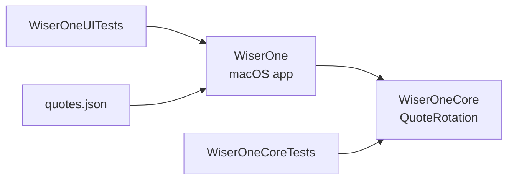
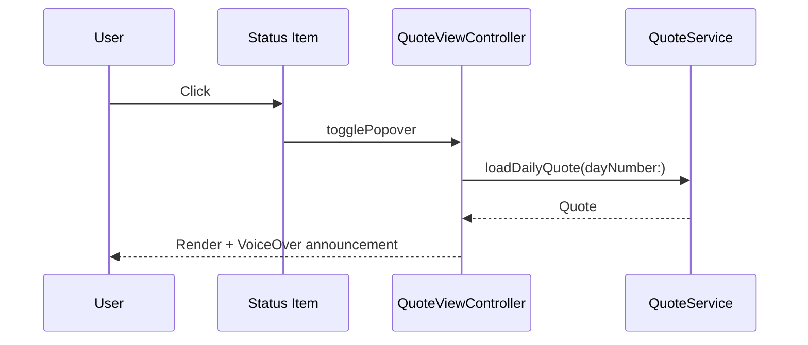

<!-- SPDX-License-Identifier: Apache-2.0 OR MIT -->

# Architecture

## Contents

- [Targets](#targets)
- [The quote pool](#the-quote-pool)
- [Selection](#selection)
- [Loading and caching](#loading-and-caching)
- [The menu-bar lifecycle](#the-menu-bar-lifecycle)
- [Accessibility](#accessibility)

## Targets

| Target | Contents |
|---|---|
| `WiserOneCore` | `QuoteRotation` — the daily rotation. Pure arithmetic, no AppKit, no I/O. |
| `WiserOne` | The macOS menu-bar app: repository, cache, service, view controller, logger. |
| `WiserOneCoreTests` | Coverage-gated tests for the core. |
| `WiserOneUITests` | Everything else, including the AppKit lifecycle. |



`WiserOneCore` previously held `QuoteResourceResolver`, which resolved
`MM-quotes` filenames for a corpus layout that no longer exists and was
called from nowhere. Because the coverage gate scopes to that target,
the 100% requirement was protecting dead code. The rotation lives there
now — it is the thing that actually decides what a reader sees.

## The quote pool

`sources/resources/quotes.json` is an ordered pool:

| Field | Meaning |
|---|---|
| `id` | Position in the pool. **Selection indexes by this.** |
| `pillar` | Thematic block |
| `quote_text` | The line |
| `author` | Attribution |
| `date_added` | The day the line was written — provenance only |
| `image_url` | Banner image |

## Selection

```swift
let day = QuoteRotation.dayNumber()                    // UTC ordinal
let index = QuoteRotation.index(forDayNumber: day,
                                poolSize: quotes.count)
```

`dayNumber` counts days since 0001-01-01, matching Python's
`date.toordinal()` where 1970-01-01 is 719163 — the ordinal
[wiserone.com](https://wiserone.com) rotates on. `index` uses floored
modulo, so a pre-epoch ordinal wraps instead of trapping, and returns
`nil` for an empty pool rather than substituting zero.

Selection used to be `(dayOfYear - 1) % count`, which reset every
January. With 136 quotes and `365 % 136 == 93`, the first 93 surfaced
twice a year and the rest once, and the sequence jumped at the year
boundary. See [ADR 0001](adr/0001-quote-pool-and-rotation.md).

## Loading and caching

```text
ResourceBundleLocator.resolve()   finds the bundle holding quotes.json
  QuoteRepository                 discovers, decodes, orders, caches
    QuoteCache.shared             partitioned by bundle
      QuoteService                holds active pool + index
```

Two details that have each caused a bug:

**Ordering is by `id`.** The repository sorted by `date_added` when the
corpus was twelve month-files merged in arbitrary order. Under a pool,
`date_added` is when a line was written, so sorting on it shuffled the
pool relative to the website: the app and the site agreed on the index
and disagreed on the quote, through a fully green suite. Entries without
an `id` sort last and log `unorderedCorpus`.

**The cache is partitioned by bundle.** It was keyed by resource name
with one merged corpus per process, and the repository consults the
cache *before* its own bundle — so a repository built on one bundle was
handed whatever another had loaded first.

## The menu-bar lifecycle



`setupStatusBarItemWithRetry` retries a bounded number of times: the
status bar is occasionally not ready at launch, and a silent failure
leaves the app running with no way to reach it.

## Accessibility

The quote and its attribution are sibling views, so a screen reader
announced two unrelated fragments and the scroll view reported itself as
an empty group. They now carry a single label, and the app posts a
`valueChanged` notification when the quote changes so a reader who never
moves focus still hears it. The logo button — an image with no title —
declares what activating it does.
