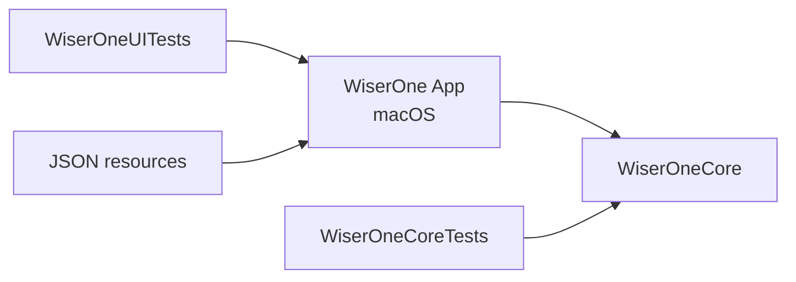
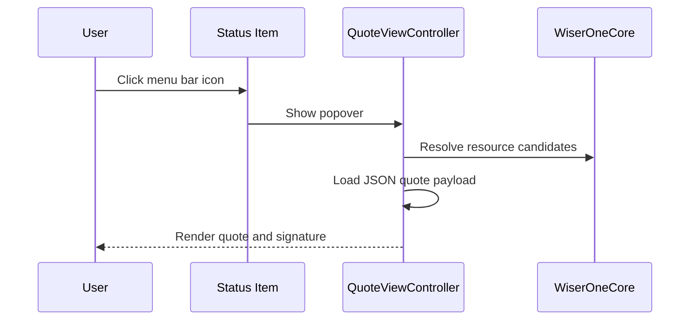

# Architecture

## Modules

- `WiserOne`: macOS AppKit runtime.
- `WiserOneCore`: portable resource resolution logic.
- `WiserOneCoreTests`: coverage-gated tests for core logic.
- `WiserOneUITests`: macOS UI smoke coverage.

## Runtime Flow

