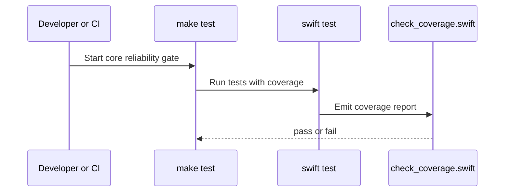

# Testing

## Commands

```sh
make test
make test-ui
make test-all
make ci-local
```

## Coverage Scope

- Coverage gate targets `sources/core`.
- Coverage gate runs the `WiserOneCoreTests` path for deterministic CI behavior.
- UI smoke checks run in `WiserOneUITests`.

## Regression Boundary


