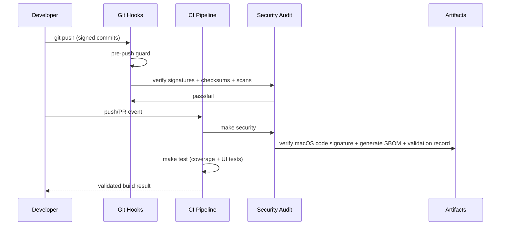

# Security and Compliance

## Security and Compliance Scorecard

- Signed commit enforcement: Pass (`scripts/security/verify-signed-commits.sh`, CI gate)
- Artifact checksum verification: Pass (`scripts/security/verify-artifact-checksums.sh`)
- Dependency checksum policy: Pass (`scripts/security/verify-dependency-checksums.sh`)
- SBOM generation: Pass (`scripts/security/generate-sbom.sh`)
- Validation record generation: Pass (`scripts/security/generate-validation-record.sh`)
- Software validation procedure documentation: Present (`governance/compliance/software-validation-procedure.md`)

## SBOM and Dependency Report

| Package | Type | License | Security Status | Evidence |
| :--- | :--- | :--- | :--- | :--- |
| `WiserOne` | Application | MIT OR Apache-2.0 | Signed commits, checksum verification, binary signature verification, CI-gated | `Package.swift`, `scripts/security/verify-signed-commits.sh`, `scripts/security/verify-macos-binary-signature.sh`, `.github/workflows/ci.yml` |
| `WiserOneCore` | Internal library | MIT OR Apache-2.0 | 100% core coverage gate, checksum and secret scans in CI | `Makefile`, `scripts/quality/test-with-coverage.sh`, `scripts/security/security-audit.sh` |
| External SwiftPM dependencies | N/A | N/A | None currently; lockfile enforcement blocks unverified additions | `governance/security/dependency-checksums.lock`, `scripts/security/verify-dependency-checksums.sh` |

SBOM output: `governance/sbom/cyclonedx-sbom.json`.

## Vulnerability and Secret Log

### P0 Immediate Threats

- None detected in the current scan set.

### P1 Compliance Gaps

- None open in current repository scope.

### P2 Best Practice Drift

- None open in current repository scope.

## Secure Path to Production



## Commit Signing Enforcement

Git local configuration:

```sh
git config commit.gpgsign true
git config tag.gpgSign true
git config gpg.format openpgp
```

CI enforcement path:

- `scripts/security/verify-signed-commits.sh`
- `scripts/git/pre-push-guard.sh`
- `scripts/security/verify-macos-binary-signature.sh`
- `.github/workflows/ci.yml`

## Platform Security Matrix

| Control | macOS | Linux | WSL2 | Status |
| :--- | :---: | :---: | :---: | :--- |
| Signed commit verification | Yes | Yes | Yes | Enforced |
| Artifact checksum verification | Yes | Yes | Yes | Enforced |
| Secret scan | Yes | Yes | Yes | Enforced |
| Insecure automation pattern scan | Yes | Yes | Yes | Enforced |
| CVE/GHSA dependency scan guard | Yes | Yes | Yes | Enforced |
| macOS binary code-signature verification | Yes | N/A | N/A | Enforced |
| Validation record artifact generation | Yes | Yes | Yes | Enforced |
| SBOM generation | Yes | Yes | Yes | Enforced |
